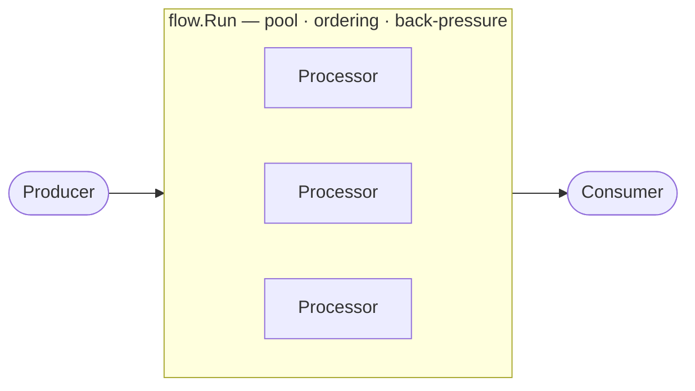

# flow

[](https://github.com/pabloos/flow/actions/workflows/ci.yml)
[](https://github.com/pabloos/flow/actions/workflows/ci.yml)
[](https://pkg.go.dev/github.com/pabloos/flow)


**Implement the ends, flow owns the pipes.** You write a `Producer`, a
`Processor` and a `Consumer` (or just pass closures); flow provides the
concurrency, ordering, back-pressure and fail-fast cancellation. Zero
dependencies.

```go
double := flow.Map(func(n int) int { return n * 2 })

var out []int
err := flow.Run(ctx, flow.Slice(1, 2, 3, 4), double, flow.Into(&out),
    flow.Workers(4), flow.Ordered())
// out == [2 4 6 8] — parallel, deterministic
```

No channels, no `WaitGroup`, no fan-in wiring in your code — just single-item
logic and a couple of options.

## The idea

A pipeline is always the same shape: a producer at one end, a consumer at the
other, work in the middle.



flow inverts control: instead of chaining channel operators yourself, you
implement three small interfaces and hand them to `Run`, which owns the
infrastructure. The design is inspired by Elixir's
[GenStage](https://github.com/elixir-lang/gen_stage), adapted to idiomatic Go.

## Install

```sh
go get github.com/pabloos/flow
```

Requires Go 1.23+.

## The three interfaces

```go
type Producer[T any]     interface { Produce(ctx context.Context, emit func(T) error) error }
type Processor[I, O any] interface { Process(ctx context.Context, in I, emit func(O) error) error }
type Consumer[T any]     interface { Consume(ctx context.Context, v T) error }
```

Implement them on a struct for stateful/complex ends, or pass a closure via the
`*Func` adapters (the `http.HandlerFunc` trick) for quick ones.

**One `Processor` is Map, Filter and FlatMap** — it depends on how many times
you `emit`:

```go
flow.ProcessorFunc[int, int](func(ctx context.Context, n int, emit func(int) error) error {
    if n < 0 { return nil }          // Filter: emit nothing
    if err := emit(n); err != nil {  // Map: emit one
        return err
    }
    return emit(n * 10)              // FlatMap: emit more
})
```

For the common cases, terse constructors hide the `emit` closure (with fallible
`Try*` variants):

```go
flow.Map(func(n int) int { return n * 2 })
flow.Filter(func(n int) bool { return n > 0 })
flow.FlatMap(func(s string) []string { return strings.Fields(s) })

flow.TryMap(func(s string) (int, error) { return strconv.Atoi(s) })
```

## Composition

`Then` composes processors **with no channel between them** — plain function
composition, so multi-stage pipelines run in-process inside each worker:

```go
parse := flow.TryMap(strconv.Atoi)                    // string -> int
scale := flow.Map(func(n int) float64 { return float64(n) * 1.5 })
proc  := flow.Then(parse, scale)                      // Processor[string, float64]
```

## Concurrency and ordering

Both are options on `Run` — your processor code stays single-item and oblivious:

```go
err := flow.Run(ctx, producer, proc, consumer,
    flow.Workers(8),   // pool size (parallelism)
    flow.Ordered(),    // reconstruct input order at the consumer
)
```

`Ordered()` restores the original input order even though workers finish at
different times (and it survives `FlatMap` sibling expansion). Without it,
outputs are consumed as they arrive. The consumer is always called from a single
goroutine, so it needs no locks.

## Batteries-included ends

```go
flow.Slice(1, 2, 3)          // Producer from values
flow.FromSeq(seq)            // Producer from a Go 1.23 iter.Seq

flow.Into(&results)          // Consumer that collects into a slice
flow.Each(func(v T) error)   // Consumer that runs a func
```

## Errors and cancellation

The first error from any end — producer, processor or consumer — cancels the
whole pipeline (fail-fast) and is returned by `Run`:

```go
err := flow.Run(ctx, prod, flow.TryMap(risky), sink)
if err != nil { /* the pipeline stopped at the first failure */ }
```

Back-pressure is implicit: `emit` blocks while the pipeline is saturated, all the
way back to the producer.

## Prior art

- [destel/rill](https://github.com/destel/rill) — composable channel operators with ordered variants; a great fit if you like the operator-chaining style.
- [reugn/go-streams](https://github.com/reugn/go-streams) — Source/Flow/Sink DSL with many connectors (Kafka, NATS, …).
- [Elixir GenStage](https://github.com/elixir-lang/gen_stage) — the demand-driven inspiration for the "implement the ends" model.

flow's niche is the interface-driven ergonomics: you plug in the ends, it owns
the pipes.

## History

flow began as the generics rewrite of [GoPipelines](https://github.com/pabloos/GoPipelines),
a pre-generics study of the [Go pipelines pattern](https://blog.golang.org/pipelines).
Its lineage is preserved in the repo:

- `v1-legacy` tag — the original `int`-only pattern.
- `channel-api` tag — the generics rewrite with an explicit channel/`Stage` API.
- `main` — the current interface-driven design.

## Limitations

- Back-pressure is by blocking `emit`, not demand-driven like GenStage.
- Multi-stage type changes compose two at a time (`Then`), a Go generics
  constraint — turned into in-process, channel-free composition.

## License

MIT
