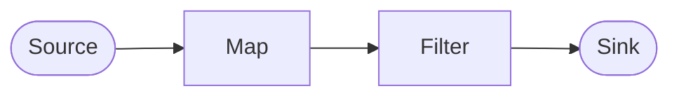
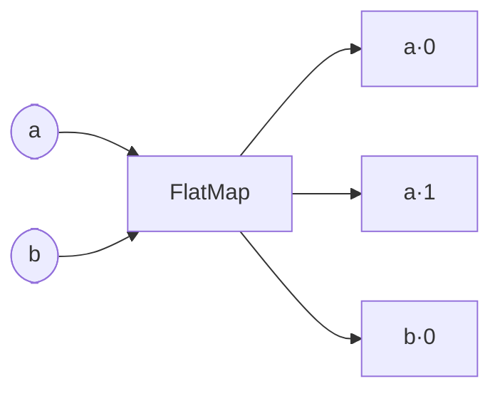
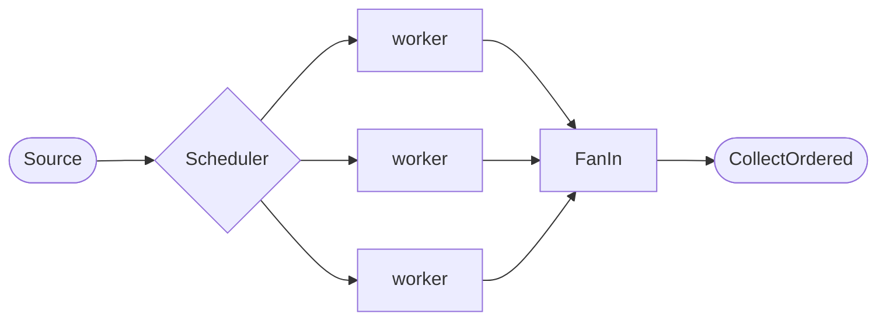
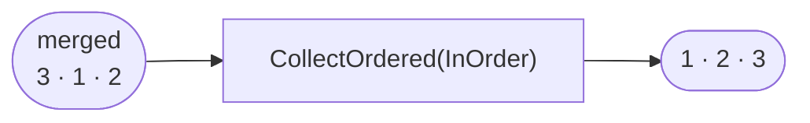
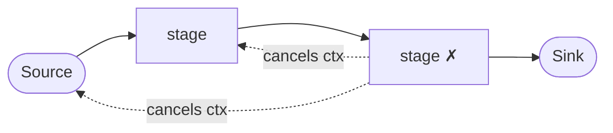

# flow

[](https://github.com/pabloos/flow/actions/workflows/ci.yml)
[](https://github.com/pabloos/flow/actions/workflows/ci.yml)
[](https://pkg.go.dev/github.com/pabloos/flow)


Composable, **type-safe concurrent pipelines** for Go, built on channels — with
fail-fast cancellation, deterministic ordering across fan-out, and bridges to Go
1.23 iterators. Zero dependencies.

```go
ctx, cancel := flow.New(context.Background())
defer cancel()

lengths := flow.Map(ctx, func(s string) (int, error) { return len(s), nil })
big     := flow.Filter(ctx, func(n int) (bool, error) { return n > 2, nil })

out, err := flow.Collect(ctx, big(lengths(flow.Source(ctx, "a", "bb", "ccc"))))
// out == [3], err == nil
```

## From `int`-only pattern to a real library

This library is the **generics rewrite of [GoPipelines](https://github.com/pabloos/GoPipelines)**,
a study of the [Go pipelines pattern](https://blog.golang.org/pipelines) I first
wrote about on [my blog](https://pabloos.github.io/concurrency/pipelines/).

That original code predates generics, so a pipeline was pinned to `int`: a stage
was `func(Flow) Flow` where `Flow = chan Element{ value int }`. It was a clean
demonstration of the pattern, but not something you could actually import.

Generics changed that. A stage is now `Stage[I, O]` — it **changes types** as
data flows through it — errors are observable at the sink, and the API composes
with the standard `iter.Seq` iterators. The pre-generics journey lives on in
this repo's history (see the milestone branches and the `v1-legacy` tag).

## Install

```sh
go get github.com/pabloos/flow
```

Requires Go 1.23+ (for the `iter` bridges).

## Concepts

A pipeline is built from three kinds of pieces:



| Piece | What it is | Examples |
|-------|-----------|----------|
| **Source** | produces a `Stream[T]` | `Source`, `From` |
| **Stage** | `func(Stream[I]) Stream[O]` | `Map`, `Filter`, `FlatMap` |
| **Sink** | drains a `Stream[T]` | `Collect`, `CollectOrdered`, `ForEach`, `Reduce`, `Seq` |

Each **box is a goroutine** and each **arrow is a typed channel**. `flow.New`
wraps a context so that the first error cancels the whole pipeline (**fail-fast**)
and surfaces at the sink.

## Building pipelines

### Sources

```go
flow.Source(ctx, 1, 2, 3)              // from values
flow.From(ctx, slices.Values(nums))    // from a Go 1.23 iter.Seq
```

### Stages

```go
flow.Map(ctx, func(n int) (int, error) { return n * 2, nil })      // transform
flow.Filter(ctx, func(n int) (bool, error) { return n > 0, nil })  // keep/drop
flow.FlatMap(ctx, func(s string) ([]string, error) {               // expand 1->N
    return strings.Fields(s), nil
})
```

`FlatMap` turns each value into zero or more values. Siblings keep their
parent's position plus a sub-index, so ordering is preserved downstream:



### Composition

Go generics can't express a variadic of type-changing stages, so composition is
explicit:

```go
// type-changing A -> B -> C: compose two at a time (or just nest calls)
parseThenScale := flow.Then(
    flow.Map(ctx, parse),   // string -> int
    flow.Map(ctx, scale),   // int -> float64
)

// same-type T -> T -> T: variadic works
clean := flow.Chain(trim, dedupe, validate) // Stage[string, string]
```

### Fan-out / fan-in with ordered results

The distinctive feature: parallelize work and still get the input order back.



```go
double := flow.Map(ctx, func(n int) (int, error) { return n * 2, nil })
square := flow.Map(ctx, func(n int) (int, error) { return n * n, nil })

in       := flow.Source(ctx, 1, 2, 3)
branches := flow.FanOut(ctx, in, flow.RoundRobin(), []flow.Stage[int, int]{double, square})
merged   := flow.FanIn(ctx, branches)

out, _ := flow.CollectOrdered(ctx, merged, flow.InOrder) // [2 4 6] — deterministic
```

`FanOutN` replicates a single worker for data parallelism:

```go
branches := flow.FanOutN(ctx, in, 4, flow.LeastBusy(), worker, flow.WithBuffer(8))
merged   := flow.FanIn(ctx, branches, flow.WithBuffer(16))
```

**Schedulers** decide which worker gets each element:

| Scheduler | Behaviour |
|-----------|-----------|
| `RoundRobin()` | even distribution, one worker after another |
| `Random()` | uniform random |
| `LeastBusy()` | shortest input queue — routes around a slow worker (needs `WithBuffer`) |

**Ordering.** Fan-out shuffles elements as they race through workers of
different speeds; `CollectOrdered` restores the sequence from each element's
origin position — surviving fan-out and `FlatMap` sibling expansion:



| Order | Result |
|-------|--------|
| `NoOrder` | arrival order (fastest, nondeterministic after fan-out) |
| `InOrder` | original input order |
| `Reverse` | input order reversed |

### Sinks

```go
out, err := flow.Collect(ctx, s)                 // []T
out, err := flow.CollectOrdered(ctx, s, flow.InOrder)
err       = flow.ForEach(ctx, s, func(v T) error { ... })
acc, err := flow.Reduce(ctx, s, 0, func(a, v int) int { return a + v })

for v := range flow.Seq(s) { ... }               // bridge back to iter.Seq
```

## Errors and cancellation

The first stage that returns an error cancels the shared context, unwinds every
goroutine, and the error is returned from the sink:



```go
ctx, cancel := flow.New(context.Background())
defer cancel()

out, err := flow.Collect(ctx, flow.Map(ctx, risky)(flow.Source(ctx, 1, 2, 3)))
if err != nil { /* the whole pipeline stopped */ }
```

> Always build the context with `flow.New` (not `context.WithCancel`): that is
> what installs the fail-fast coordinator the stages share.

## Buffering

Channels are unbuffered by default (strict backpressure). `WithBuffer(n)` sizes
the channel a stage, source, or fan-out produces:

```go
flow.Map(ctx, fn, flow.WithBuffer(64))
```

## Limitations

- Nested `FlatMap` collapses ordering to the inner expansion (`Element` carries a
  single sub-position).
- `RoundRobin` distributes strictly, so a slow worker can stall it — use
  `LeastBusy` with buffering to route around it.

## License

MIT
